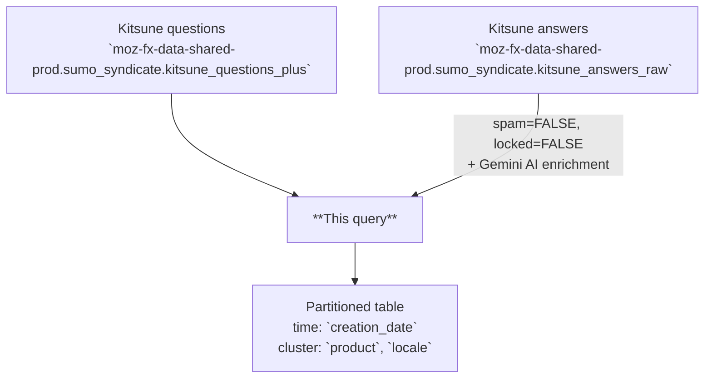

# Kitsune Retrieval Index

AI-enriched retrieval table derived from Kitsune (SUMO), one row per question–answer pair per creation date. Combines original question and answer fields with Gemini-generated summaries, classifications, sentiment scores, and vector embeddings to support semantic search and grounded question answering over Mozilla Support data.

---

## 📌 Overview

| | |
|---|---|
| **Grain** | One row per `(creation_date, question_id, answer_id)` |
| **Source** | `moz-fx-data-shared-prod.sumo_syndicate.kitsune_questions_plus`, `moz-fx-data-shared-prod.sumo_syndicate.kitsune_answers_raw` |
| **DAG** | `bqetl_analytics_tables` · daily · incremental |
| **Partitioning** | `creation_date` *(partition filter required)* |
| **Clustering** | `product`, `locale` |
| **Retention** | No automatic expiration |
| **Owner** | lvargas@mozilla.com |
| **Version** | v1 (initial version) |

**Use cases:** support question analysis · semantic search via embeddings · sentiment trend monitoring

---

## ⚠️ Analysis Caveats

> Read this section before writing queries. These are the most common sources of incorrect results.

- **`creation_date` filter is required.** The table enforces a partition filter — omitting it will error or cause a full table scan.
- **Filter on `metadata.status = 'SUCCESS'` when using AI fields.** Rows with `FAILED` status have incomplete or out-of-range values in `summary_llm`, `category_llm`, `language_llm`, `entities_llm`, `topics_llm`, and `sentiment_score`. Do not aggregate or analyse those fields without this filter.
- **For embedding/retrieval, filter on `embedding IS NOT NULL` at minimum.** This is less strict than `status = 'SUCCESS'` and preserves rows where the embedding succeeded but one LLM field did not. Use `status = 'SUCCESS'` when you also need clean LLM fields.
- **`answer_content` is not embedded.** Vector similarity reflects question text (`title` + `content`) only — high similarity means similar *questions*, not better *answers*.
- **Always embed query text with `gemini-embedding-001`.** Mixing embedding models produces mathematically meaningless distances.
- **Vote counts are snapshotted at indexing time.** `num_helpful_votes` and `num_unhelpful_votes` reflect totals at the time the question was first processed, not current values. They grow staler as questions age.
- **Unanswered questions are included.** `answer_id` and `answer_content` are NULL for questions with no answer (LEFT JOIN). Filter on `answer_id IS NOT NULL` if you only want answered questions.

---

## 🗺️ Data Flow



---

## 🧠 How It Works

1. **Input** — `kitsune_questions_plus` provides one row per support question; `kitsune_answers_raw` provides answers joined by `question_id`.
2. **AI generation** — `AI.GENERATE` with Gemini produces summary, category, language, entities, topics, and sentiment score per question.
3. **Embedding** — `AI.EMBED` with `gemini-embedding-001` generates a dense vector from concatenated `title` and `content`.
4. **Scoring and metadata** — A recency score uses exponential decay (7-day window); a metadata struct captures model versions, quality scores, and a validation status flag.
5. **Data inclusion** — Only non-spam, non-locked questions and answers are included; no additional bot or synthetic exclusions are applied.

---

## 🧾 Key Fields

### Dimensions

| Category | Fields |
|---|---|
| Date | `creation_date` |
| Product & Topic | `product`, `locale`, `topic`, `tier{1\|2\|3}_topic` |
| Content | `title`, `content`, `answer_content`, `type` |
| Flags | `is_self_answer`, `is_firefox_product` |
| AI-generated | `summary_llm`, `category_llm`, `language_llm`, `entities_llm`, `topics_llm` |

### Metrics

| Category | Fields |
|---|---|
| Votes | `num_helpful_votes`, `num_unhelpful_votes` |
| Scores | `sentiment_score`, `recency_score` |
| Embedding | `embedding` |

---

## 🔍 Working with Embeddings

The `embedding` column is a dense float array produced by `AI.EMBED(CONCAT(title, ' ', content), endpoint => 'gemini-embedding-001')`. Use it to find questions similar to a free-text query, cluster support topics, or power grounded QA retrieval.

> **Prerequisites:** running `AI.EMBED` on your own query text requires Vertex AI access and incurs BigQuery ML costs. Contact your data platform team if you hit permission errors.

**Semantic search with `VECTOR_SEARCH`:**

```sql
-- Find the 10 most semantically similar Firefox Desktop questions to a free-text query
SELECT base.question_id, base.title, base.summary_llm, base.product, distance
FROM VECTOR_SEARCH(
  TABLE `moz-fx-data-shared-prod.customer_experience_derived.kitsune_retrieval_index_v1`,
  'embedding',
  (SELECT AI.EMBED('Firefox password manager not saving logins', endpoint => 'gemini-embedding-001').result),
  top_k => 10,
  distance_type => 'COSINE'
)
WHERE base.creation_date >= DATE_SUB(CURRENT_DATE(), INTERVAL 30 DAY)
  AND base.product = 'Firefox Desktop'
  AND base.embedding IS NOT NULL
ORDER BY distance ASC;
```

**Distance interpretation (cosine distance, lower = more similar):**

| Range | Meaning |
|---|---|
| < 0.3 | Strong match |
| 0.3 – 0.6 | Related |
| > 0.6 | Loosely related |

---

## 🧩 Example Queries

```sql
-- 1. Daily question volume and average sentiment by product
SELECT
  creation_date,
  product,
  COUNT(*) AS question_count,
  AVG(sentiment_score) AS avg_sentiment
FROM `moz-fx-data-shared-prod.customer_experience_derived.kitsune_retrieval_index_v1`
WHERE creation_date >= DATE_SUB(CURRENT_DATE(), INTERVAL 7 DAY)
  AND metadata.status = 'SUCCESS'
GROUP BY 1, 2
ORDER BY 1 DESC;
```

```sql
-- 2. Top AI-generated categories by locale with helpful vote ratio
SELECT
  locale,
  category_llm,
  COUNT(*) AS question_count,
  SAFE_DIVIDE(SUM(num_helpful_votes), SUM(num_helpful_votes + num_unhelpful_votes)) AS helpful_rate
FROM `moz-fx-data-shared-prod.customer_experience_derived.kitsune_retrieval_index_v1`
WHERE creation_date >= DATE_SUB(CURRENT_DATE(), INTERVAL 30 DAY)
  AND metadata.status = 'SUCCESS'
GROUP BY 1, 2
ORDER BY question_count DESC;
```

```sql
-- 3. Negative sentiment questions with successful AI generation for a specific product
SELECT
  creation_date,
  title,
  summary_llm,
  sentiment_score,
  metadata.status
FROM `moz-fx-data-shared-prod.customer_experience_derived.kitsune_retrieval_index_v1`
WHERE creation_date >= DATE_SUB(CURRENT_DATE(), INTERVAL 7 DAY)
  AND product = 'Firefox Desktop'
  AND sentiment_score < -0.5
  AND metadata.status = 'SUCCESS'
ORDER BY sentiment_score ASC
LIMIT 50;
```

---

## 🔧 Implementation Notes

- Incremental: filtered by a configurable start date; one partition written per run.
- Questions source is `kitsune_questions_plus` (shared-prod syndicate); answers source is `kitsune_answers_raw` (sumo-prod).
- Answers are joined to questions via `question_id`; unanswered questions retain NULL `answer_id` and `answer_content`.
- `metadata.status` is `SUCCESS` only when all AI-generated fields pass completeness and range checks.
- `SAFE_DIVIDE` recommended for vote ratios to avoid division-by-zero.

---

## 📌 Notes & Conventions

- `recency_score` = `EXP(-age_in_days / 7)` — exponential decay; 1.0 for today, ~0.37 after 7 days.
- `sentiment_score` ranges -1.0 (very negative) to 1.0 (very positive), 0 is neutral.
- `product` is normalized from raw Kitsune values (e.g., "firefox" → "Firefox Desktop", "mobile" → "Fenix").
- `type` is always "question"; future versions may include additional content types.
- `embedding` is a dense float array suitable for cosine similarity or nearest-neighbor search.

---

## 📋 Change Control

### Prompt version log

| `prompt_version` | Date | Summary |
|---|---|---|
| `v1` | 2026-04-29 | Initial — summary (8 words), category (1–2 words), language (BCP 47), entities (×3), topics (×3), sentiment score |

### When to update

| What changed | Field to update in `query.sql` |
|---|---|
| Prompt text or `output_schema` in `AI.GENERATE` | `prompt_version` — increment to `v2`, `v3`, … |
| Generative model (currently `gemini-2.5-pro-001`) | `metadata.model_version` literal |
| Embedding model (currently `gemini-embedding-001`) | `metadata.embedding_version` literal + re-embed full history |

`prompt_version` is stored per row in `metadata.prompt_version`, so rows written under different prompts can be identified and re-processed during backfills. Add a row to this table for every change.

---

## 🗃️ Schema & Related Tables

- Full field definitions: [`schema.yaml`](schema.yaml)
- **Upstream**: `moz-fx-data-shared-prod.sumo_syndicate.kitsune_questions_plus` — Kitsune (SUMO) support questions with enriched metadata
- **Upstream**: `moz-fx-data-shared-prod.sumo_syndicate.kitsune_answers_raw` — Raw Kitsune answer records
- **Downstream**: Customer experience dashboards and semantic search applications
